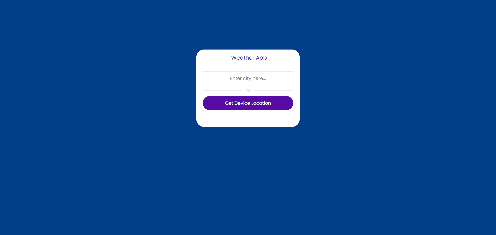
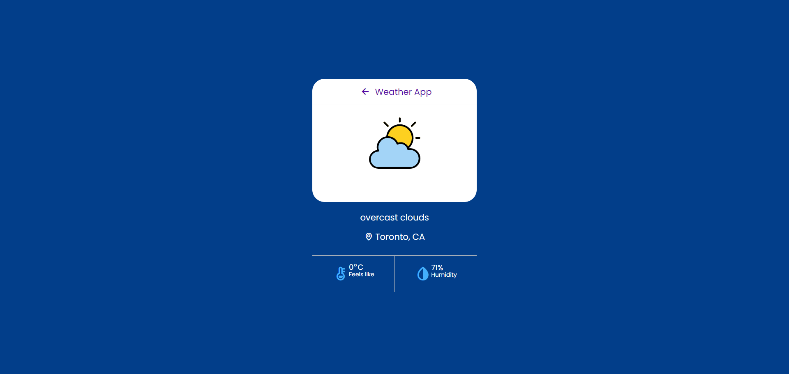

# weather

## Description

This is an application that will allow you to get a five day forcast of the local area weather. This demostrates my knowledge of HTML, CSS, JS and APIs.

## User Story

AS A traveler
I WANT to see the weather outlook for multiple cities
SO THAT I can plan a trip accordingly

## Acceptance Criteria

- GIVEN a weather dashboard with form inputs
- WHEN I search for a city
  
- THEN I am presented with current and future conditions for that city and that city is added to the search history
- WHEN I view current weather conditions for that city
- THEN I am presented with the city name, the date, an icon representation of weather conditions, the temperature, the humidity, and the the wind speed
- WHEN I view future weather conditions for that city
  
- THEN I am presented with a 5-day forecast that displays the date, an icon representation of weather conditions, the temperature, the wind speed, and the humidity
- WHEN I click on a city in the search history
- THEN I am again presented with current and future conditions for that city

## Deployment

https://kzefram.github.io/weather/

## Table of Contents

- [Installation](#installation)
- [Usage](#usage)
- [Credits](#credits)

## Installation

There is no installation needed as this is a web application.

## Usage

The purpose of this application is to show how I can use HTML, CSS, JS and etc. This is an application where you can see the weather for five days. I wasn't able to get the 5-day forecast working without going through a couple of tutorials. And they still don't work

## Credits

- Karen Bourgeois,
- UNB/Edx,
- https://www.joshwcomeau.com/css/custom-css-reset/,
- iso.500px.com,
- devjaiye - https://github.com/devjaiye/js-weather-app
- Корміч, Олександр Ігорович. "Система управління онлайн бібліотекою." 2021, https://core.ac.uk/download/541278504.pdf?
- https://www.youtube.com/@FrameworkTV

## Badges

https://github.com/users/kzefram/achievements/quickdraw

https://github.com/users/kzefram/achievements/pull-shark

https://github.com/users/kzefram/achievements/yolo
